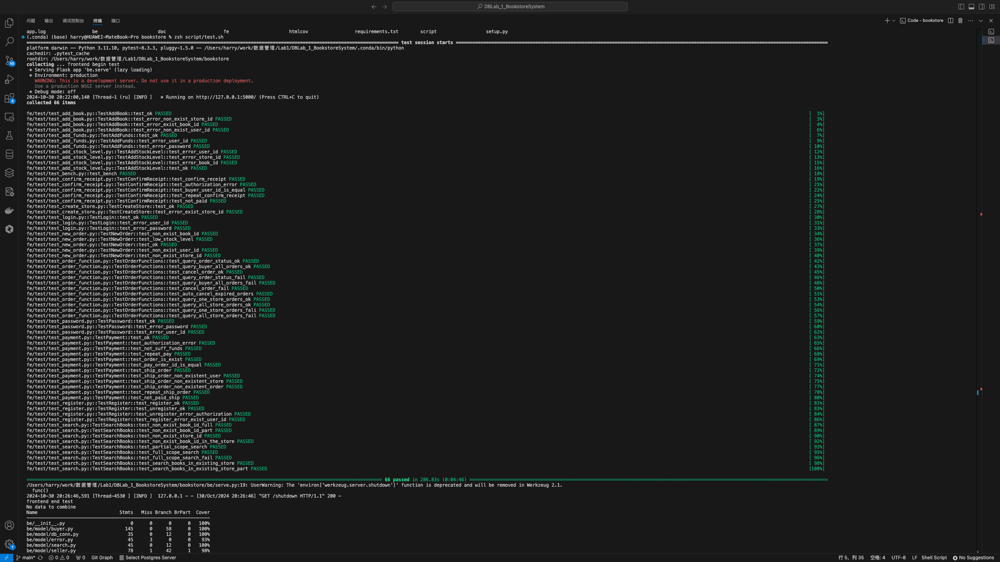
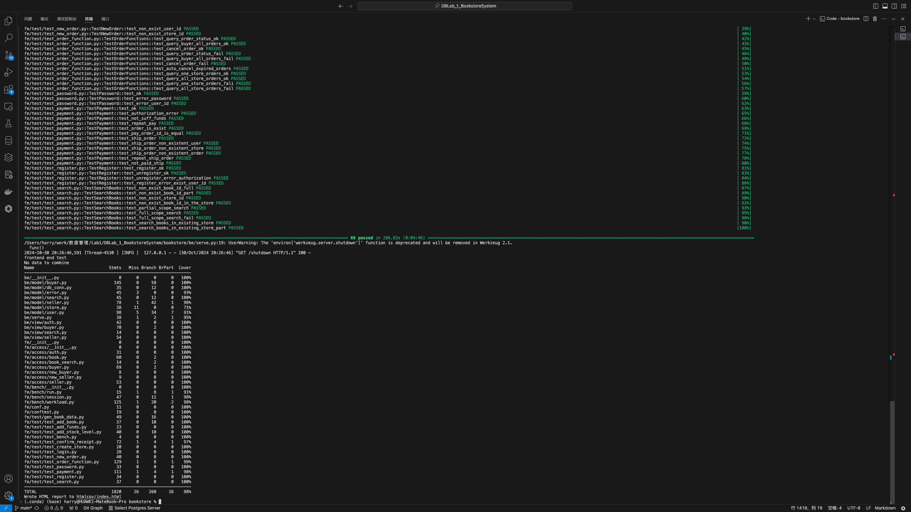
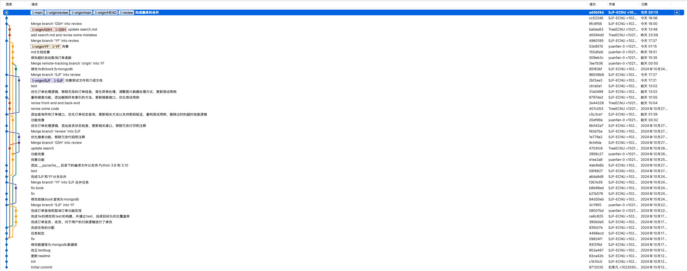

# 数据库大作业实验报告

# 组员及分工
## 组员
石季凡
顾树焕 
袁凡
## 分工
1. （石季凡）发货 -> 收货：
该操作应对于订单、用户（买家和卖家）均要进行修改和添加

2.  (石季凡) 数据库的转换：
将数据库从SQL转换成MongoDB，并修改对应的操作代码

3. （顾树焕）搜索图书：
用户可以通过关键字搜索，参数化的搜索方式；
如搜索范围包括，题目，标签，目录，内容；全站搜索或是当前店铺搜索。
如果显示结果较大，需要分页
(使用全文索引优化查找)
该板块较为独立，主要任务针对于数据库的`books`与`store`

4. （袁凡）订单状态，订单查询和取消订单：
用户可以查自已的历史订单，用户也可以取消订单。
取消订单可由买家主动地取消，或者买家下单后，经过一段时间超时仍未付款，订单也会自动取消。该操作应对于订单、用户（买家和卖家）均要进行修改和添加

4. 各自完成对自己任务的模块进行测试，并合并入测试脚本

# 文档数据库的设计

## schema如下
```python
Collection: books
  _id: ObjectId
  id: str
  title: str
  author: NoneType, str
  publisher: str
  original_title: NoneType, str
  translator: NoneType, str
  pub_year: str
  pages: int
  price: int
  currency_unit: str
  binding: str
  isbn: str
  author_intro: str
  book_intro: str
  content: str
  tags: str
  picture: bytes

Collection: store
  _id: ObjectId
  store_id: str
  book_id: str
  book_info: str
  stock_level: int

Collection: user_store
  _id: ObjectId
  user_id: str
  store_id: str

Collection: new_order
  _id: ObjectId
  order_id: str
  user_id: str
  store_id: str
  is_paid: bool
  is_shipped: bool
  is_received: bool
  order_completed: bool
  status: str
  created_time: datetime

Collection: user
  _id: ObjectId
  user_id: str
  password: str
  balance: int
  token: str
  terminal: str

Collection: new_order_detail
  _id: ObjectId
  order_id: str
  book_id: str
  count: int
  price: int
```

## index如下

```python
Collection: books
  Index Name: _id_
    Key: SON([('_id', 1)])
    Unique: False
    Sparse: False
    Background: False

  Index Name: text_idx
    Key: SON([('_fts', 'text'), ('_ftsx', 1)])
    Unique: False
    Sparse: False
    Background: False


Collection: store
  Index Name: _id_
    Key: SON([('_id', 1)])
    Unique: False
    Sparse: False
    Background: False


Collection: user_store
  Index Name: _id_
    Key: SON([('_id', 1)])
    Unique: False
    Sparse: False
    Background: False


Collection: new_order
  Index Name: _id_
    Key: SON([('_id', 1)])
    Unique: False
    Sparse: False
    Background: False


Collection: user
  Index Name: _id_
    Key: SON([('_id', 1)])
    Unique: False
    Sparse: False
    Background: False

Collection: new_order_detail
  Index Name: _id_
    Key: SON([('_id', 1)])
    Unique: False
    Sparse: False
    Background: False
```


# 功能及其测试说明

## 买家付款
为了实现发货收货功能并和订单取消功能配合，我将原本的支付流程修改为了买家向平台付款->卖家发货->买家收货->买家确认收货->平台向卖家付款

我们首先来看买家付款

### 路由如下

#### URL：
POST http://[address]/buyer/pay_to_platform

#### Request

##### Body:
```json
{
  "user_id": "buyer_id",
  "order_id": "order_id",
  "password": "password"
}
```
### 后端代码实现如下
```python
    def pay_to_platform(self, user_id: str, password: str, order_id: str) -> (int, str): # type: ignore
        try:
            # 查找订单
            order = self.db.new_order.find_one({"order_id": order_id})
            if order is None:
                return error.error_invalid_order_id(order_id)

            buyer_id = order['user_id']

            # 检查用户身份
            if buyer_id != user_id:
                return error.error_authorization_fail()

            user = self.db.user.find_one({"user_id": buyer_id})
            if user is None or user['password'] != password:
                return error.error_authorization_fail()
                

            # 检查是否已经付款
            if order.get('is_paid', False):
                return error.error_order_is_paid(order_id)

            # 计算订单总价
            order_details = self.db.new_order_detail.find({"order_id": order_id})
            total_price = sum(detail['count'] * detail['price'] for detail in order_details)

            if user['balance'] < total_price:
                return error.error_not_sufficient_funds(order_id)

            # 扣除买家的余额，平台收款
            self.db.user.update_one(
                {"user_id": buyer_id, "balance": {"$gte": total_price}},
                {"$inc": {"balance": -total_price}}
            )

            # 更新订单状态为已付款
            self.db.new_order.update_one(
                {"order_id": order_id},
                {"$set": {"is_paid": True}}
            )

        except Exception as e:# pragma: no cover
            return 530, "{}".format(str(e))

        return 200, "ok"
```
执行流程如下：
1. 查找订单：若无匹配订单，返回错误。

2. 验证买家身份：buyer_id与user_id不匹配，返回授权失败。

3. 验证用户密码：用户不存在或密码不匹配，返回授权失败。

4. 检查订单支付状态：已支付订单，返回错误。

5. 计算订单总价：未支付订单，计算总价。

6. 检查用户余额：余额不足，返回资金不足错误。

7. 更新用户余额和订单状态：余额足够，扣款并更新订单为已支付。

8. 异常处理：捕获异常，返回错误代码和信息。

9. 成功返回：所有步骤成功，返回成功代码和"ok"。

该段代码的测试在后续和收货、发货一起进行说明。

## 卖家发货

### 路由设计如下
#### URL
POST http://[address]/seller/ship

#### Request
Headers:

key | 类型 | 描述 | 是否可为空
---|---|---|---
token | string | 登录产生的会话标识 | N

Body:
```json
{
  "user_id": "$seller id$",
  "store_id": "$store id$",
  "order_id": "$order id$"
}
```

key | 类型 | 描述 | 是否可为空
---|---|---|---
user_id | string | 卖家用户ID | N
store_id | string | 商铺ID | N
order_id | string | 订单ID | N

#### Response
Status Code:
码 | 描述
--- | ---
200 | 发货成功
511 | 卖家用户ID不存在
401 | 授权失败
518 | 订单不存在
520 | 订单未支付
513 | 商店不存在
529 | 重复发货

### 后端代码实现如下

```python
def ship(
        self,
        user_id: str,
        store_id: str,
        order_id: str,
        ):
    try:
        # 检查用户是否存在
        if not self.user_id_exist(user_id):
            return error.error_non_exist_user_id(user_id)
        # 检查商店是否存在
        if not self.store_id_exist(store_id):
            return error.error_non_exist_store_id(store_id)
        # 检查订单是否存在
        if not self.order_id_exist(order_id):
            return error.error_invalid_order_id(order_id)
        # 检查订单是否已经支付
        if not self.order_is_paid(order_id):
            return error.error_not_be_paid(order_id)
        # 检查订单是否已经发货
        if self.order_is_shipped(order_id):
            return error.error_order_is_shipped(order_id)
        # 更新订单状态
        self.db["new_order"].update_one(
            {"order_id": order_id, "store_id": store_id},
            {"$set": {"is_shipped": True}}
        )
    
    except Exception as e:# pragma: no cover
        return 520, "{}".format(str(e))
    return 200, "ok"
```
执行流程如下：
1. 参数检查：ship 方法验证并处理订单，需 self, user_id, store_id, order_id。

2. 用户存在性检查：若用户不存在，返回错误。

3. 商店存在性检查：若商店不存在，返回错误。

4. 订单存在性检查：若订单不存在，返回错误。

5. 订单支付状态检查：若订单未支付，返回错误。

6. 订单发货状态检查：若订单已发货，返回错误。

7. 更新订单状态：通过数据库更新，标记订单已发货。

8. 异常处理：捕获异常，返回错误代码和信息。

9. 成功返回：操作成功，返回代码 200 和 "ok"。

## 买家确认收货
### 路由设计如下
#### URL：
POST http://[address]/buyer/add_funds

#### Request

##### Body:
```json
{
  "user_id": "buyer_id",
  "order_id": "order_id",
  "password": "password"
}
```

##### 属性说明：

变量名 | 类型 | 描述 | 是否可为空
---|---|---|---
user_id | string | 买家用户ID | N
order_id | string | 订单ID | N
password | string | 买家用户密码 | N 

#### Response
Status Code:

码 | 描述
--- | ---
200 | 充值成功
401 | 授权失败
520 | 订单未支付
528 | 订单已收货

### 后端代码实现如下
```python
def confirm_receipt_and_pay_to_seller(self, user_id: str, password:str,order_id: str) -> (int, str): # type: ignore
        try:
            # 查找订单
            order = self.db.new_order.find_one({"order_id": order_id})

            buyer_id = order['user_id']

            # 检查用户身份
            if buyer_id != user_id:
                return error.error_authorization_fail()
            user = self.db.user.find_one({"user_id": buyer_id})
            if user is None or user['password'] != password:
                return error.error_authorization_fail()
            
            # 检查是否已经付款
            if not order.get('is_paid', False):
                return error.error_not_be_paid(order_id)

            # 检查是否已确认收货
            if order.get('is_received', False):
                return error.error_order_is_confirmed(order_id)

            buyer_id = order['user_id']
            store_id = order['store_id']

            seller = self.db.user_store.find_one({"store_id": store_id})
            seller_id = seller['user_id']

            # 计算订单总价
            order_details = self.db.new_order_detail.find({"order_id": order_id})
            total_price = sum(detail['count'] * detail['price'] for detail in order_details)

            # 平台将钱转给卖家
            self.db.user.update_one(
                {"user_id": seller_id},
                {"$inc": {"balance": total_price}}
            )

            # 更新订单状态为已确认收货
            self.db.new_order.update_one(
                {"order_id": order_id},
                {"$set": {"is_received": True}}
            )

            # 更新订单状态为已完成
            self.db.new_order.update_one(
                {"order_id": order_id},
                {"$set": {"order_completed": True}}
            )

        except Exception as e:# pragma: no cover
            return 530, "{}".format(str(e))

        return 200, "ok"
```

执行流程如下：
1. 查找并验证订单及用户身份。

2. 检查订单是否已付款且未确认收货。

3. 计算订单总价并从卖家余额中增加相应金额。

4. 更新订单状态为已确认收货和已完成。

5. 捕获异常并返回错误信息；成功则返回"ok"。

### 功能测试
我们通过编写测试代码来对于上述的三个功能来进行测试，测试的内容包括基本功能和各种错误类型，代码如下
```python
def test_ok(self):
    code = self.buyer.add_funds(self.total_price)
    assert code == 200
    code = self.buyer.payment(self.order_id)
    assert code == 200

def test_authorization_error(self):
    code = self.buyer.add_funds(self.total_price)
    assert code == 200
    self.buyer.password = self.buyer.password + "_x"
    code = self.buyer.payment(self.order_id)
    assert code == 401

def test_not_suff_funds(self):
    code = self.buyer.add_funds(self.total_price - 1)
    assert code == 200
    code = self.buyer.payment(self.order_id)
    assert code == 519

def test_repeat_pay(self):
    code = self.buyer.add_funds(self.total_price)
    assert code == 200
    code = self.buyer.payment(self.order_id)
    assert code == 200

    code = self.buyer.payment(self.order_id)
    assert code == 527

def test_order_is_exist(self):
    code = self.buyer.add_funds(self.total_price)
    assert code == 200
    
    self.order_id = self.order_id + "_x"

    code = self.buyer.payment(self.order_id)
    assert code == 518

def test_pay_order_id_is_equal(self):
    code = self.buyer.add_funds(self.total_price)
    assert code == 200
    
    self.buyer.user_id = self.buyer.user_id + "_x"
    
    code = self.buyer.payment(self.order_id)
    assert code == 401

def test_ship_order(self):
    code= self.buyer.add_funds(self.total_price)
    assert code == 200
    code = self.buyer.payment(self.order_id)

    code = self.seller.ship(self.seller_id, self.store_id, self.order_id)
    assert code == 200

def test_ship_order_non_existent_user(self):
    code= self.buyer.add_funds(self.total_price)
    assert code == 200
    code = self.buyer.payment(self.order_id)
    code = self.seller.ship("non_existent_user", self.store_id, self.order_id)
    assert code == 511

def test_ship_order_non_existent_store(self):
    code= self.buyer.add_funds(self.total_price)
    assert code == 200
    code = self.buyer.payment(self.order_id)
    code = self.seller.ship(self.seller_id, "non_existent_store", self.order_id)
    assert code == 513

def test_ship_order_non_existent_order(self):
    code= self.buyer.add_funds(self.total_price)
    assert code == 200
    code = self.buyer.payment(self.order_id)
    code = self.seller.ship(self.seller_id, self.store_id, "non_existent_order")
    assert code == 518

def test_repeat_ship_order(self):
    code= self.buyer.add_funds(self.total_price)
    assert code == 200
    code = self.buyer.payment(self.order_id)
    
    code = self.seller.ship(self.seller_id, self.store_id, self.order_id)
    assert code == 200

    code = self.seller.ship(self.seller_id, self.store_id, self.order_id)
    assert code == 529

def test_not_paid_ship(self):
    code = self.seller.ship(self.seller_id, self.store_id, self.order_id)
    assert code == 520
def test_confirm_receipt(self):
    code = self.buyer.add_funds(self.total_price)
    assert code == 200
    
    code = self.buyer.payment(self.order_id)
    assert code == 200

    code = self.buyer.confirm_receipt_and_pay_to_seller(self.order_id)
    assert code == 200

def test_authorization_error(self):
    code = self.buyer.add_funds(self.total_price)
    assert code == 200

    self.buyer.password = self.buyer.password + "_x"
    code = self.buyer.confirm_receipt_and_pay_to_seller(self.order_id)
    assert code == 401

def test_buyer_user_id_is_equal(self):
    code = self.buyer.add_funds(self.total_price)
    assert code == 200

    code = self.buyer.payment(self.order_id)
    assert code == 200

    self.buyer.user_id = self.buyer.user_id + "_x"

    code = self.buyer.confirm_receipt_and_pay_to_seller(self.order_id)
    assert code == 401

def test_repeat_confirm_receipt(self):
    code = self.buyer.add_funds(self.total_price)
    assert code == 200

    code = self.buyer.payment(self.order_id)
    assert code == 200

    code = self.buyer.confirm_receipt_and_pay_to_seller(self.order_id)
    assert code == 200

    code = self.buyer.confirm_receipt_and_pay_to_seller(self.order_id)
    assert code == 528

def test_not_paid(self):
    code = self.buyer.add_funds(self.total_price)
    assert code == 200

    code = self.buyer.confirm_receipt_and_pay_to_seller(self.order_id)
    assert code == 520
```
上述的测试代码中，我模拟了各种可能产生的错误，并接受验证对应的错误码，从而保证测试的完整性。
## 搜索图书

#### 首先是路由的实现：

#### URL：
POST http://[address]/search/search_books

#### Request

##### Header:

key | 类型 | 描述 | 是否可为空
---|---|---|---
token | string | 登录产生的会话标识 | N

##### Body:
```json
{
  "keyword": "关键词",
  "search_scope": "搜索范围",
  "search_in_store": "True or False",
  "store_id": "商店ID"
}
```

##### 属性说明：

变量名 | 类型 | 描述 | 是否可为空
---|---|---|---
keyword | string | 搜索关键词 | N
search_scope | string | 搜索范围，可以是多个字段如'title tags'	也可以是全局搜索'all' | Y，默认为'all'
search_in_store | boolean | 是否只在指定店铺内搜索 | Y，默认为false
store_id | string | 店铺ID，仅当search_in_store为true时需要 | Y，默认为null

##### 具体搜索函数实现代码如下：  
首先导入相关的库：
```python
from pymongo import MongoClient, TEXT
from pymongo.errors import PyMongoError
from be.model import error
```
然后定义一个BookStoreSearcher类：
1. 初始化  
所做的操作分别是：  
-  连接MongoDB数据库
-  连接到bookstore数据库
-  分别读取books表以及store表
-  删除所有存在的索引（这是为了后面能够成功创建索引）
-  创建全文索引
```python
class BookStoreSearcher:
    def __init__(self, connection_string="mongodb://localhost:27017/", dbname='bookstore'):
        self.client = MongoClient(connection_string)
        self.db = self.client[dbname]
        self.booksdb = self.db['books']
        self.storedb = self.db['store']
        self.delete_all_indexes()
        self.ensure_text_index_exists()
```
2. 删除所有索引的实现  
注意这里的`# pragma: no cover`，这是因为数据库本身的错误很难去test，因此加入这行代码表示不测试数据库本身操作出错，下面也有这类问题，统一在此说明。
```python
    def delete_all_indexes(self):
        try:
            self.booksdb.drop_indexes()
            print("All indexes deleted successfully.")
        except PyMongoError as e: # pragma: no cover
            print(f"An error occurred while deleting all indexes: {e}")
```
3. 创建全文索引
-  创建的索引名为`text_idx`，包含了四个字段：`title`、`tags`、`content`、`book_intro`。
-  每个字段的数据类型均被指定为`TEXT`，表明它们将被用作全文搜索的索引。全文搜索索引允许对文本内容进行更复杂的查询，比如基于关键词的搜索等，这里查询书籍就是使用了基于关键词的搜索。
```python
    def ensure_text_index_exists(self):
        try:
            self.booksdb.create_index(
                    [('title', TEXT), ('tags', TEXT), ('content', TEXT), ('book_intro', TEXT)],
                    name='text_idx')
        except PyMongoError as e: # pragma: no cover
            print(f"An error occurred while ensuring the text index exists: {e}")
```
4. 查询store_id是否存在
这一步很重要，在后续的搜索中，如果指定了在某个store中进行搜索，但是该store_id查询不到会对结果有所影响。
```python
    def store_id_exist(self, store_id):
        return self.storedb.find_one({"store_id": store_id}) is not None
```
5. 查询函数的具体实现
传入的四个参数如下：  

变量名 | 类型 | 描述 | 是否可为空
---|---|---|---
keyword | string | 搜索关键词 | N
search_scope | string | 搜索范围，可以是多个字段如'title tags'	也可以是全局搜索'all' | Y，默认为'all'
search_in_store | boolean | 是否只在指定店铺内搜索 | Y，默认为false
store_id | string | 店铺ID，仅当search_in_store为true时需要 | Y，默认为null

然后记录下所有的查询条件存放在match_query中（因为查询条件可能会很多）
```python
    def search_books(self, keyword, search_scope='all', search_in_store=False, store_id=None):
        match_query = {}
```
6. 分情况讨论  
大情况一：如果选定了要在店铺搜索，并且指定了store_id：  
-  小情况1：如果store_id不存在，则返回第一个错误。（具体的错误以及错误码在后面介绍，下面不再赘述）
-  小情况2：将store表中该store_id对应的book_id都取出来。
-  小情况3：如果搜索条件为全文搜索，那么使用`$text`操作符来搜索关键字`keyword`，同时要求匹配文档的`id`必须存在于`book_ids`列表中，表示只搜索特定店铺内的存在的书籍。
-  小情况4：如果搜索条件为部分字段，创建一个条件列表，其中将多个搜索条件进行拆分，使用正则表达式进行匹配，并且不区分大小写，依次遍历每一个搜索条件。
```python
        if search_in_store and store_id is not None:
            if not self.store_id_exist(store_id):
                return error.error_store_not_found(store_id)

            try:
                book_ids = [book['book_id'] for book in self.storedb.find({'store_id': store_id})]
            except PyMongoError as e: # pragma: no cover
                return error.db_operation_error(e)

            if search_scope == 'all':
                match_query['$text'] = {'$search': keyword}
                match_query['id'] = {'$in': book_ids}
            else:
                conditions = [{scope: {'$regex': keyword, '$options': 'i'}} for scope in search_scope.split(' ')]
                match_query['$or'] = conditions
                match_query['id'] = {'$in': book_ids}
```
大情况二：直接采用关键字搜索的方式搜索books表  
其中细分的两种小情况也都是和大情况一中的小情况34一样：  
-  小情况1：如果搜索条件为全文搜索，那么使用`$text`操作符来搜索关键字`keyword`。
-  小情况2：如果搜索条件为部分字段，创建一个条件列表，其中将多个搜索条件进行拆分，使用正则表达式进行匹配，并且不区分大小写，依次遍历每一个搜索条件。
```
        else:
            if search_scope == 'all':
                match_query['$text'] = {'$search': keyword}
            else:
                conditions = [{scope: {'$regex': keyword, '$options': 'i'}} for scope in search_scope.split(' ')]
                match_query['$or'] = conditions
```
7. 使用聚合管道pipeline：
-  `$match`阶段：过滤输入文档流，确保只有符合条件的文档通过。
-  `$lookup`阶段，进行`store`表和`books`表的关联查询，通过`store`表中的`book_id`和`books`表中的`id`进行关联。并且将结果存储在`store_info`中。  
-  `$addFields`阶段，第一个确保`store_info`字符按至少是一个数组，即使是空的；第二个是用于提取`store_info`中的第一个元素`store_id`，将其赋值为当前文档的`store_id`字段；如果`store_info`中的第一个元素`store_id`为空，则被设置为`Unknown Shop`。
-  `$project`阶段，在最终输出的文档中，排除`picture`、`store_info`和`_id`字段。
```python
        pipeline = [
            {'$match': match_query},
            {'$lookup': {
                'from': 'store',
                'localField': 'id',
                'foreignField': 'book_id',
                'as': 'store_info'
            }},
            {'$addFields': {'store_info': {'$ifNull': ['$store_info', []]}}},
            {'$addFields': {'store_id': {'$ifNull': [{'$arrayElemAt': ['$store_info.store_id', 0]}, 'Unknown Shop']}}},
            {'$project': {'picture': 0, 'store_info': 0, '_id': 0}}
        ]
```
8. 进行最终查询，如果没有找到结果，那么根据是否在店铺中寻找返回不同的错误；如果找到了结果，返回正确的码200以及相应的results。
```python
        try:
            results = list(self.booksdb.aggregate(pipeline))
            if not results:
                if not search_in_store:
                    return error.error_book_not_found(keyword)
                else:
                    return error.error_book_not_found_in_the_store(keyword, store_id)
            return 200, results
        except PyMongoError as e: # pragma: no cover
            return error.db_operation_error(e)
```
至此，搜索的代码已经解读完毕。

#### Response

Status Code:

码 | 描述
--- | ---
200 | 搜索成功
401 | 授权失败
523 | 书籍keyword不存在
524 | 店铺ID不存在
525 | 在指定店铺内未找到书籍keyword
530 | 数据库操作错误

##### Body:
```json
{
  "message": [搜索结果列表],
  "code": 状态码
}
```

##### 属性说明：

变量名 | 类型 | 描述 | 是否可为空
---|---|---|---
message | array | 包含搜索结果的数组 | N
code    | integer | 响应状态码      | N

##### 测试文件如下：
注：代码注释已经囊括了该代码的含义，就不赘述了。
```python
import pytest
from fe.access import book_search
from fe import conf

class TestSearchBooks:
    @pytest.fixture(autouse=True)
    def setup(self):
        # 初始化 bookstore_searcher 和相关数据
        self.store_id = "test_add_books_store_id_848aa78c-887a-11ef-89e5-2e81db39535e"
        self.keyword = "美丽心灵"
        self.searcher = book_search.BookSearcher(conf.URL)
        yield

    def test_non_exist_book_id_full(self):
        # 测试不存在的书籍，搜索是在book数据库中进行，搜索范围是全局，期望返回 523 错误码
        code = self.searcher.search_books(
            keyword="nonexistent_book",
            search_scope="all",
            search_in_store=False,
            store_id=self.store_id
        )
        assert code == 523
    
    def test_non_exist_book_id_part(self):
        # 测试不存在的书籍，搜索是在book数据库中进行，搜索范围是部分，期望返回 523 错误码
        code = self.searcher.search_books(
            keyword="nonexistent_book",
            search_scope="title tag",
            search_in_store=False,
            store_id=self.store_id
        )
        assert code == 523

    def test_non_exist_store_id(self):
        # 测试不存在的store_id，期望返回 524 错误码
        code = self.searcher.search_books(
            keyword=self.keyword,
            search_scope="all",
            search_in_store=True,
            store_id="non_existent_store_id"
        )
        assert code == 524

    def test_non_exist_book_id_in_the_store(self):
        # 测试书籍不存在store_id对应的store中，期望返回 525 错误码
        code = self.searcher.search_books(
            keyword="nonexistent_book",
            search_scope="all",
            search_in_store=True,
            store_id=self.store_id
        )
        assert code == 525

    def test_partial_scope_search(self):
        # 测试部分匹配 scope 搜索
        code = self.searcher.search_books(
            keyword=self.keyword,
            search_scope="title tags",
            search_in_store=False
        )
        assert code == 200

    def test_full_scope_search(self):
        # 测试全范围搜索
        code = self.searcher.search_books(
            keyword=self.keyword,
            search_scope="all",
            search_in_store=False
        )
        assert code == 200
    
    def test_full_scope_search_fail(self):
        # 测试全范围搜索，但是搜索失败
        code = self.searcher.search_books(
            keyword="nonexistent_book",
            search_scope="all",
            search_in_store=False
        )
        assert code == 523

    def test_search_books_in_existing_store(self):
        # 测试在存在的store_id中搜索书籍
        code = self.searcher.search_books(
            keyword=self.keyword,
            search_scope="all",
            search_in_store=True,
            store_id=self.store_id
        )
        assert code == 200
    
    def test_search_books_in_existing_store_part(self):
        # 测试在存在的store_id中搜索书籍，搜索范围是部分
        code = self.searcher.search_books(
            keyword=self.keyword,
            search_scope="title tag",
            search_in_store=True,
            store_id=self.store_id
        )
        assert code == 200
```

#### 前后端的连接函数代码如下：
用于解析前端发送的请求，然后再向后端进行发送，获取响应结果。
```python
import requests
from urllib.parse import urljoin

class BookSearcher:
    def __init__(self, url_prefix):
        self.url_prefix = urljoin(url_prefix, "search/")
        self.token = ""

    def search_books(self, keyword: str, search_scope: str = "all", search_in_store: bool = False, store_id: str = None) -> (int, dict):
        """
        搜索书籍功能
        :param keyword: 搜索关键词
        :param search_scope: 搜索范围 (默认为 "all")
        :param search_in_store: 是否在特定商店中搜索 (默认为 False)
        :param store_id: 可选参数，指定商店 ID
        :return: 返回状态码和搜索结果
        """
        json_data = {
            "keyword": keyword,
            "search_scope": search_scope,
            "search_in_store": search_in_store
        }

        if store_id is not None:
            json_data["store_id"] = store_id

        url = urljoin(self.url_prefix, "search_books")
        headers = {"token": self.token} 
        response = requests.post(url, headers=headers, json=json_data)
        return response.status_code
```
## 买家查询订单状态

#### URL：
POST http://[address]/buyer/query_order_status

#### Request

Headers:

key | 类型 | 描述 | 是否可为空
---|---|---|---
token | string | 登录产生的会话标识 | N

Body:

```json
{
  "user_id": "$user id$",
  "order_id": "$order id$",
  "password": "$password$"
}
```

##### 属性说明：

key | 类型 | 描述 | 是否可为空
---|---|---|---
user_id | string | 买家用户ID | N
order_id | string | 订单ID | N
password | string | 用户密码 | N

#### Response

- `Status Code`

码 | 描述
--- | ---
200 | 查询成功
401 | 授权失败
511 | 用户ID不存在
518 | 非法订单ID
530 | 其它异常


- `message`

message | 描述
--- | ---
ok  | 查询成功
authorization fail | 授权失败
non exist user id {`user_id`} | 用户ID不存在
invalid order id {`order_id`} | 非法订单ID
Exception e | 异常信息

- `order_status`


order_status | 描述
--- | ---
`pending`  | 待支付
`paid` | 已支付
`shipped` | 已发货
`received` | 已收货
`completed` | 已完成
`canceled` | 已取消
`None` | 异常状态

#### 对应测试代码
```python
def test_query_order_status_ok(self):
    # 查询成功
    code, _, _ = self.buyer.query_order_status(self.order_id, self.buyer_id, self.buyer_password)
    assert code == 200
  
def test_query_order_status_fail(self):
    # 用户ID不存在
    user_id_test = self.buyer_id + "_x"
    code, _, _ = self.buyer.query_order_status(self.order_id, user_id_test, self.buyer_password)
    assert code == 511
    # 非法订单ID
    order_id_test = self.order_id + "_x"
    code, _, _ = self.buyer.query_order_status(order_id_test, self.buyer_id, self.buyer_password)
    assert code == 518
    # 授权失败
    password_test = self.buyer_password + "_x"
    code, _, _ = self.buyer.query_order_status(self.order_id, self.buyer_id, password_test)
    assert code == 401
```

#### 对应后端实现代码
```python
def query_order_status(self, user_id: str, order_id: str, password) -> (int, str, str): # type: ignore
    try:
        # 检查用户是否存在
        if not self.user_id_exist(user_id):
            return error.error_non_exist_user_id(user_id) + ("None",)
        # 检查用户密码是否正确
        user = self.db.user.find_one({"user_id": user_id})
        if user['password'] != password:
            return error.error_authorization_fail() + ("None",)
        # 查找订单
        order = self.db.new_order.find_one({"order_id": order_id, "user_id": user_id})
        if order is None:
            return error.error_invalid_order_id(order_id) + ("None",)
        # 返回订单状态
        order_status = self.ORDER_STATUS[order['status']]
        return 200, "ok", order_status
    except Exception as e: # pragma: no cover
        return 530, "{}".format(str(e)) + ("None",)
```
上述代码实现了一个查询订单状态的功能，说明：

1. **检查用户是否存在**：
   - 调用 `self.user_id_exist(user_id)` 方法检查用户是否存在。如果不存在，返回错误信息 `error.error_non_exist_user_id(user_id)`，并附带一个额外的 `"None"` 查询异常状态。

2. **检查用户密码是否正确**：
   - 从数据库中查找用户信息，并检查用户提供的密码是否与数据库中的密码匹配。如果不匹配，返回错误信息 `error.error_authorization_fail()`，并附带一个额外的 `"None"` 查询异常状态。

3. **查找订单**：
   - 在数据库中查找指定 `order_id` 和 `user_id` 的订单。如果订单不存在，返回错误信息 `error.error_invalid_order_id(order_id)`，并附带一个额外的 `"None"` 查询异常状态。   

4. **返回订单状态**：
   - 如果订单存在，根据订单的 `status` 字段，从 `self.ORDER_STATUS` 字典中获取对应的订单状态描述，并返回状态码 `200`、消息 `"ok"` 以及订单状态描述。   
   `ORDER_STATUS` 字典定义如下:
   `
    ORDER_STATUS = {
        "pending": "待支付",
        "paid": "已支付",
        "shipped": "已发货",
        "received": "已收货",
        "completed": "已完成",
        "canceled": "已取消"
    }
   `

5. **异常处理**：
   - 如果在执行过程中发生任何异常，捕获异常并返回状态码 `530` 和异常信息的字符串，并附带一个额外的 `"None"` 查询异常状态。


## 买家查询所有订单信息

#### URL：
POST http://[address]/buyer/query_buyer_all_orders

#### Request

Headers:

key | 类型 | 描述 | 是否可为空
---|---|---|---
token | string | 登录产生的会话标识 | N

Body:

```json
{
  "user_id": "$user id$",
  "password": "$password$"
}
```

##### 属性说明：

key | 类型 | 描述 | 是否可为空
---|---|---|---
user_id | string | 买家用户ID | N
password | string | 用户密码 | N

#### Response

- `Status Code`

码 | 描述
--- | ---
200 | 查询成功
401 | 授权失败
511 | 用户ID不存在
530 | 其它异常


- `message`

message | 描述
--- | ---
ok  | 查询成功
authorization fail | 授权失败
non exist user id {`user_id`} | 用户ID不存在
Exception e | 异常信息

- `orders`

orders | 描述
--- | ---
`orders`  | 订单详情
`None` | 异常状态

#### 对应测试代码
```python
def test_query_buyer_all_orders_ok(self):
    # 查询成功
    code, _, _ = self.buyer.query_buyer_all_orders(self.buyer_id, self.buyer_password)
    assert code == 200

def test_query_buyer_all_orders_fail(self):
    # 用户ID不存在
    user_id_test = self.buyer_id + "_x"
    code, _, _ = self.buyer.query_buyer_all_orders(user_id_test, self.buyer_password)
    assert code == 511
    # 授权失败
    password_test = self.buyer_password + "_x"
    code, _, _ = self.buyer.query_buyer_all_orders(self.buyer_id, password_test)
    assert code == 401
```

#### 对应后端实现代码

```python
def query_buyer_all_orders(self, user_id: str, password) -> (int, str, list): # type: ignore
    try:
        # 检查用户是否存在
        if not self.user_id_exist(user_id):
            return error.error_non_exist_user_id(user_id) + ("None",)
        # 检查用户密码是否正确
        user = self.db.user.find_one({"user_id": user_id})
        if user['password'] != password:
            return error.error_authorization_fail() + ("None",)
        # 查找用户的所有订单
        orders = list(self.db.new_order.find({"user_id": user_id}))
        return 200, "ok", str(orders)
    except Exception as e: # pragma: no cover
        return 530, "{}".format(str(e)), None
```

上述代码实现了一个查询买家所有订单的功能，说明如下：

1. **检查用户是否存在**：
   - 调用 `self.user_id_exist(user_id)` 方法检查用户是否存在。如果不存在，返回错误信息 `error.error_non_exist_user_id(user_id)`，并附带一个额外的 `"None"` 查询异常状态。

2. **检查用户密码是否正确**：
   - 从数据库中查找用户信息，并检查用户提供的密码是否与数据库中的密码匹配。如果不匹配，返回错误信息 `error.error_authorization_fail()`，并附带一个额外的 `"None"` 查询异常状态。

3. **查找用户的所有订单**：
   - 在数据库中查找指定 `user_id` 的所有订单，并将结果转换为列表。

4. **返回订单列表**：
   - 如果成功找到订单，返回状态码 `200`、消息 `"ok"` 以及订单列表信息。

5. **异常处理**：
   - 如果在执行过程中发生任何异常，捕获异常并返回状态码 `530` 和异常信息的字符串，并附带一个 `None`查询异常状态。


## 买家取消订单

#### URL：
POST http://[address]/buyer/cancel_order

#### Request

Headers:

key | 类型 | 描述 | 是否可为空
---|---|---|---
token | string | 登录产生的会话标识 | N

Body:
```json
{
  "user_id": "$user id$",
  "order_id": "$order id$",
  "password": "$password$"
}
```

##### 属性说明：

key | 类型 | 描述 | 是否可为空
---|---|---|---
user_id | string | 买家用户ID | N
order_id | string | 订单ID | N
password | string | 用户密码 | N

#### Response

- `Status Code`

码 | 描述
--- | ---
200 | 取消成功
401 | 授权失败
511 | 用户ID不存在
518 | 非法订单ID
521 | 已支付，取消订单失败
530 | 其它异常


- `message`

message | 描述
--- | ---
ok  | 取消成功
authorization fail | 授权失败
non exist user id {`user_id`} | 用户ID不存在
invalid order id {`order_id`} | 非法订单号ID
cannot be canceled, order id {`order_id`} | 已支付，取消订单失败
Exception e | 异常信息

#### 对应测试代码
```python
def test_cancel_order_ok(self):
    # 取消成功
    code, _ = self.buyer.cancel_order(self.order_id, self.buyer_id, self.buyer_password)
    assert code == 200

def test_cancel_order_fail(self):
    # 用户ID不存在
    user_id_test = self.buyer_id + "_x"
    code, _ = self.buyer.cancel_order(self.order_id, user_id_test, self.buyer_password)
    assert code == 511
    # 非法订单ID
    order_id_test = self.order_id + "_x"
    code, _ = self.buyer.cancel_order(order_id_test, self.buyer_id, self.buyer_password)
    assert code == 518
    # 授权失败
    password_test = self.buyer_password + "_x"
    code, _ = self.buyer.cancel_order(self.order_id, self.buyer_id, password_test)
    assert code == 401
    # 已支付，取消订单失败
    code = self.buyer.add_funds(self.total_price)
    assert code == 200
    code = self.buyer.payment(self.order_id)
    assert code == 200
    code, _ = self.buyer.cancel_order(self.order_id, self.buyer_id, self.buyer_password)
    assert code == 521
```

#### 对应后端实现代码

```python
def cancel_order(self, user_id: str, order_id: str, password) -> (int, str): # type: ignore
    try:
        # 检查用户是否存在
        if not self.user_id_exist(user_id):
            return error.error_non_exist_user_id(user_id)
        # 检查用户密码是否正确
        user = self.db.user.find_one({"user_id": user_id})
        if user['password'] != password:
            return error.error_authorization_fail()
        # 查找订单
        order = self.db.new_order.find_one({"order_id": order_id, "user_id": user_id})
        if order is None:
            return error.error_invalid_order_id(order_id)
        # 检查订单是否已经支付
        if order.get('is_paid', False):
            return error.error_cannot_be_canceled(order_id)
        # 取消订单，更新订单信息
        self.db.new_order.update_one(
            {"order_id": order_id},
            {"$set": {"status": "canceled"}}
        )
        # 恢复库存
        order_details = self.db.new_order_detail.find({"order_id": order_id})
        for detail in order_details:
            self.db.store.update_one(
                {"store_id": order['store_id'], "book_id": detail['book_id']},
                {"$inc": {"stock_level": detail['count']}}
            )
        # 删除订单，根据业务逻辑自选
        # self.db.new_order.delete_one({"order_id": order_id})
        # self.db.new_order_detail.delete_many({"order_id": order_id})
    except Exception as e: # pragma: no cover
        return 530, "{}".format(str(e))
    return 200, "ok"
```

上述代码实现了一个取消订单的功能，说明如下：

1. **检查用户是否存在**：
   - 调用 `self.user_id_exist(user_id)` 方法检查用户是否存在。如果不存在，返回错误信息 `error.error_non_exist_user_id(user_id)`。

2. **检查用户密码是否正确**：
   - 从数据库中查找用户信息，并检查用户提供的密码是否与数据库中的密码匹配。如果不匹配，返回错误信息 `error.error_authorization_fail()`。

3. **查找订单**：
   - 在数据库中查找指定 `order_id` 和 `user_id` 的订单。如果订单不存在，返回错误信息 `error.error_invalid_order_id(order_id)`。

4. **检查订单是否已经支付**：
   - 检查订单是否已经支付。如果订单已经支付，返回错误信息 `error.error_cannot_be_canceled(order_id)`。

5. **取消订单，更新订单信息**：
   - 更新订单的状态为 `"canceled"`。

6. **恢复库存**：
   - 查找订单的详细信息，并根据订单中的书籍数量恢复库存。

7. **删除订单（可选）**：
   - 根据业务逻辑，可以选择删除订单及其详细信息。代码中注释掉了这部分，表示这是一个可选操作。

8. **异常处理**：
   - 如果在执行过程中发生任何异常，捕获异常并返回状态码 `530` 和异常信息的字符串。


## 超时未支付，自动取消订单

#### URL：
POST http://[address]/buyer/auto_cancel_expired_orders

#### Request

定时自动发送 `request`

#### Response

- `Status Code`

码 | 描述
--- | ---
200 | 自动取消成功
530 | 其它异常


- `message`

message | 描述
--- | ---
ok  | 自动取消成功
not | 自动取消失败


#### 对应测试代码
```python
def test_auto_cancel_expired_orders(self):
    # 循环调用自动取消接口，每隔3秒一次，执行5次
    for _ in range(5):  
        code, message = self.buyer.auto_cancel_expired_orders()
        assert code == 200
        print(f"Auto cancel expired orders call result: {message}")
        time.sleep(2)  # 等待2秒
```

#### 对应后端实现代码

```python
def auto_cancel_expired_orders(self):
    try:
        # 获取当前时间
        now = datetime.utcnow()
        # 查找所有未支付的订单
        pending_orders = self.db.new_order.find({"is_paid": False})
        for order in pending_orders:
            # 确保 order 字典中存在 "created_time" 键
            if "created_time" in order:
                created_time_dict = order["created_time"]
                time_diff = abs(now - created_time_dict)
                # 超时时间为5秒，检查订单是否已经超时
                if time_diff < timedelta(seconds=5):
                    # 取消订单
                    order_id = order['order_id']
                    self.db.new_order.update_one(
                        {"order_id": order_id},
                        {"$set": {"status": "canceled"}}
                    )
                    # 恢复库存
                    order_details = self.db.new_order_detail.find({"order_id": order_id})
                    for detail in order_details:
                        self.db.store.update_one(
                            {"store_id": order['store_id'], "book_id": detail['book_id']},
                            {"$inc": {"stock_level": detail['count']}})
    except Exception as e: # pragma: no cover
        return 530, "not"
    return 200, "ok"
```

上述代码实现了一个自动取消过期订单的功能，说明如下：

1. **获取当前时间**：
   - 使用 `datetime.utcnow()` 获取当前的 UTC 时间。

2. **查找所有未支付的订单**：
   - 从数据库中查找所有 `is_paid` 为 `False` 的订单。

3. **检查订单是否超时**：
   - 遍历每个未支付的订单，检查订单的创建时间 `created_time` 是否存在。
   - 计算当前时间与订单创建时间的时间差 `time_diff`。
   - 如果时间差小于 5 秒，则认为订单未超时。

4. **取消订单并恢复库存**：
   - 如果订单超时（时间差大于等于 5 秒），则更新订单状态为 `"canceled"`。
   - 查找订单的详细信息，并根据订单中的书籍数量恢复库存。

5. **异常处理**：
   - 如果在执行过程中发生任何异常，捕获异常并返回状态码 `530` 和消息 `"not"`。

## 商家查询指定商铺订单信息


#### URL

POST http://[address]/seller/query_one_store_orders

#### Request
Headers:

key | 类型 | 描述 | 是否可为空
---|---|---|---
token | string | 登录产生的会话标识 | N

Body:
```json
{
  "user_id": "$seller id$",
  "store_id": "$store id$",
  "password": "$password$"
}
```
key | 类型 | 描述 | 是否可为空
---|---|---|---
user_id | string | 卖家用户ID | N
store_id | string | 商铺ID | N
password | string | 用户密码 | N

#### Response

- `Status Code`

码 | 描述
--- | :--
200 | 查询商铺订单信息成功
401 | 授权失败
511 | 用户ID不存在
513 | 商铺ID不存在
522 | 卖家不存在该商铺
530 | 其它异常

- `message`

message | 描述
--- | ---
ok  | 查询成功
authorization fail | 授权失败
non exist user id {`user_id`} | 用户不存在
non exist store id {`store_id`} | 商铺不存在
no store for user, user id {`user_id`} | 卖家不存在该商铺
Exception e | 异常信息

- `orders`


orders | 描述
--- | ---
`orders`  | 订单详情
`None` | 异常状态

#### 对应测试代码
```python
def test_query_one_store_orders_ok(self):
    # 查询商铺订单信息成功
    code, _, _ = self.seller.query_one_store_orders(self.seller.seller_id, self.store_id, self.seller_password)
    assert code == 200

def test_query_one_store_orders_fali(self):
    # 用户ID不存在
    seller_id_test = self.seller.seller_id+ "_x"
    code, _, _ = self.seller.query_one_store_orders(seller_id_test, self.store_id, self.seller_password)
    assert code == 511

    # 商铺ID不存在
    store_id_test = self.store_id + "_x"
    code, _, _ = self.seller.query_one_store_orders(self.seller.seller_id, store_id_test, self.seller_password)
    assert code == 513

    # 授权失败
    password_test = self.seller_password+ "_x"
    code, _, _ = self.seller.query_one_store_orders(self.seller.seller_id, self.store_id, password_test)
    assert code == 401

    # 卖家不存在该商铺
    code, _, _ = self.seller.query_one_store_orders(self.seller.seller_id, self.store_id_lists[2], self.seller_password)
    assert code == 522
```

#### 对应后端实现代码
```python
def query_one_store_orders(self, user_id: str, store_id: str, password) -> (int, str, list): # type: ignore
    try:
        # 检查用户与商店是否存在
        if not self.user_id_exist(user_id):
            return error.error_non_exist_user_id(user_id) + ("None",)
        if not self.store_id_exist(store_id):
            return error.error_non_exist_store_id(store_id) + ("None",)
        # 检查用户密码是否正确
        user = self.db.user.find_one({"user_id": user_id})
        if user['password'] != password:
            return error.error_authorization_fail() + ("None",)
        # 查找用户是否存在该商店
        user_store = self.db.user_store.find_one({"user_id": user_id, "store_id": store_id})
        if not user_store:
            return error.error_no_store_found(user_id) + ("None",)
        # 查找该商店的所有订单
        orders = list(self.db.new_order.find({"store_id": store_id}))
    except Exception as e: # pragma: no cover
        return 530, "{}".format(str(e)), "None"
    return 200, "ok", str(orders)
```

上述代码实现了卖家查询指定商铺订单信息的功能，说明如下：

1. **检查用户与商店是否存在**：
   - 调用 `self.user_id_exist(user_id)` 方法检查用户是否存在。如果不存在，返回错误信息 `error.error_non_exist_user_id(user_id)`，并附带一个额外的 `"None"` 查询异常状态。
   - 调用 `self.store_id_exist(store_id)` 方法检查商店是否存在。如果不存在，返回错误信息 `error.error_non_exist_store_id(store_id)`，并附带一个额外的 `"None"` 查询异常状态。

2. **检查用户密码是否正确**：
   - 从数据库中查找用户信息，并检查用户提供的密码是否与数据库中的密码匹配。如果不匹配，返回错误信息 `error.error_authorization_fail()`，并附带一个额外的 `"None"` 查询异常状态。

3. **查找用户是否存在该商店**：
   - 在数据库中查找用户是否拥有指定商店。如果没有找到，返回错误信息 `error.error_no_store_found(user_id)`，并附带一个额外的 `"None"` 查询异常状态。

4. **查找该商店的所有订单**：
   - 在数据库中查找指定 `store_id` 的所有订单，并将结果转换为列表。并将订单信息返回。

5. **异常处理**：
   - 如果在执行过程中发生任何异常，捕获异常并返回状态码 `530` 和异常信息的字符串，并附带一个 `"None"` 查询异常状态。


## 商家查询自己的所有商铺订单信息


#### URL

POST http://[address]/seller/query_all_store_orders

#### Request
Headers:

key | 类型 | 描述 | 是否可为空
---|---|---|---
token | string | 登录产生的会话标识 | N

Body:

```json
{
  "user_id": "$seller id$",
  "password": "$password$"
}
```
key | 类型 | 描述 | 是否可为空
---|---|---|---
user_id | string | 卖家用户ID | N
password | string | 用户密码 | N

#### Response

- `Status Code`

码 | 描述
--- | :--
200 | 查询商铺订单信息成功
401 | 授权失败
511 | 用户ID不存在
522 | 卖家不存在商铺
530 | 其它异常

- `message`

message | 描述
--- | ---
ok  | 查询成功
authorization fail | 授权失败
non exist user id {`user_id`} | 用户不存在
no store for user, user id {`user_id`} | 卖家不存在商铺
Exception e | 异常信息

- `orders`

orders | 描述
--- | ---
`orders`  | 订单详情
`None` | 异常状态

#### 对应测试代码
```python
def test_query_all_store_orders_ok(self):
    # 查询商铺订单信息成功
    code, _, _ = self.seller.query_all_store_orders(self.seller.seller_id, self.seller_password)
    assert code == 200

def test_query_all_store_orders_fail(self):
    # 用户ID不存在
    seller_id_test = self.seller.seller_id+ "_x"
    code, _, _ = self.seller.query_all_store_orders(seller_id_test, self.seller_password)
    assert code == 511

    # 授权失败
    password_test = self.seller_password+ "_x"
    code, _, _ = self.seller.query_all_store_orders(self.seller.seller_id, password_test)
    assert code == 401

    # 卖家不存在商铺
    code, _, _ = self.seller.query_all_store_orders(self.buyer_id, self.buyer_password)
    assert code == 522
```


#### 对应后端实现代码
```python
def query_all_store_orders(self, user_id: str, password) -> (int, str, list): # type: ignore
    try:
        # 检查用户是否存在
        if not self.user_id_exist(user_id):
            return error.error_non_exist_user_id(user_id) + ("None",)
        # 检查用户密码是否正确
        user = self.db.user.find_one({"user_id": user_id})
        if user['password'] != password:
            return error.error_authorization_fail() + ("None",)
        # 查找用户的商店
        user_stores = self.db.user_store.find({"user_id": user_id})
        # 检查是否有商店
        if self.db.user_store.count_documents({"user_id": user_id}) == 0:
            return error.error_no_store_found(user_id) + ("None",)
        all_store_orders = {}
        for user_store in user_stores:
            store_id = user_store['store_id']
            # 查找该商店的所有订单
            orders = list(self.db.new_order.find({"store_id": store_id}))
            all_store_orders[store_id] = orders
    except Exception as e: # pragma: no cover
        return 530, "{}".format(str(e)), "None"
    return 200, "ok", str(all_store_orders)
```

上述代码实现了卖家查询其所有商铺订单信息的功能，说明如下：

1. **检查用户是否存在**：
   - 调用 `self.user_id_exist(user_id)` 方法检查用户是否存在。如果不存在，返回错误信息 `error.error_non_exist_user_id(user_id)`，并附带一个额外的 `"None"` 查询异常状态。

2. **检查用户密码是否正确**：
   - 从数据库中查找用户信息，并检查用户提供的密码是否与数据库中的密码匹配。如果不匹配，返回错误信息 `error.error_authorization_fail()`，并附带一个额外的 `"None"` 查询异常状态。

3. **查找用户的商店**：
   - 在数据库中查找用户拥有的所有商店。

4. **检查是否有商店**：
   - 检查用户是否拥有商店。如果没有商店，返回错误信息 `error.error_no_store_found(user_id)`，并附带一个额外的 `"None"` 查询异常状态。

5. **查找所有商店的订单**：
   - 遍历用户的每个商店，查找该商店的所有订单，并将结果存储在字典 `all_store_orders` 中，键为 `store_id`，值为订单列表。

6. **异常处理**：
   - 如果在执行过程中发生任何异常，捕获异常并返回状态码 `530` 和异常信息的字符串，并附带一个 `"None"` 查询异常状态。

# 测试脚本运行结果
完成上述工作后，我们运行测试脚本检测功能的完整性


该覆盖率不包括不需要测试的文件
```bash
be/app.py
fe/data
```
# 亮点说明
## 全文索引
本次实验中，为了提高数据库查询的性能，使用了全文索引。全文索引允许对文本内容进行更复杂的查询，比如基于关键词的搜索等，这里查询书籍就是使用了基于关键词的搜索。
-  创建的索引名为`text_idx`，包含了四个字段：`title`、`tags`、`content`、`book_intro`。
-  每个字段的数据类型均被指定为`TEXT`，表明它们将被用作全文搜索的索引。全文搜索索引允许对文本内容进行更复杂的查询，比如基于关键词的搜索等，这里查询书籍就是使用了基于关键词的搜索。
```python
    def ensure_text_index_exists(self):
        try:
            self.booksdb.create_index(
                    [('title', TEXT), ('tags', TEXT), ('content', TEXT), ('book_intro', TEXT)],
                    name='text_idx')
        except PyMongoError as e: # pragma: no cover
            print(f"An error occurred while ensuring the text index exists: {e}")
```
## Git版本管理
本次实验中，我们使用了Git进行版本管理，该项目共有五条分支，分别是：
- `main`：主分支，用于存放确认可用的代码，并用于最终版本的提交。
- `SJF` ：任务1的分支，用于实现任务1，以组员姓名命名。
- `YF`  ：任务2的分支，用于实现任务2，以组员姓名命名。
- `GSH` ：任务3的分支，用于实现任务3，以组员姓名命名。
- `review`：用于讨论并合并测试版本的代码。

各个分支的commit图如下：
